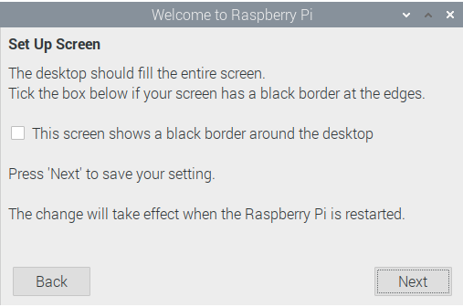

==========================
Raspberry Pi OS 10 Desktop
==========================

This tutorial is done using 2020-08-20-raspios-buster-armf.zip or better
known as Raspberry Pi OS (32-bit) with desktop from 
`here <https://www.raspberrypi.org/downloads/raspberry-pi-os/>`_

Flash the image to the SD card with either
`balenaEtcher <https://www.balena.io/etcher/>`_ or use the
`Raspberry Pi Imager <https://www.raspberrypi.org/downloads/>`_ for the
OS that you have on your PC.

Connect a mouse, keyboard and monitor to the Raspberry Pi and boot up.

When you boot up to the desktop you get the welcome screen, you might
want to write down the IP address if your going to use SSH or VNC later.

Click on `Next` then set the country, language, time zone and check off
use English language and keyboard the press `Next`.

.. image:: images/welcome-02.png
   :align: center

Set the password you want to use and press `Next`.

.. image:: images/welcome-03.png
   :align: center

On the next screen usually you just press `Next`.

You can either setup a wireless network or skip it.

Update the software page press `Next` to update.

After the update click `Ok`

.. image:: images/welcome-07.png
   :align: center

Then click `Restart`

Setup a temporary user, in a terminal do the following
::

  sudo adduser temp
  sudo adduser temp sudo

.. image:: images/temp-user-01.png
   :align: center

Click on the Raspberry in the upper left corner then select
`Preferences` then `Raspberry Pi Configuration`

* System Tab
   * Set the Hostname you want to use
   * Turn off auto login
   * Network at Boot Wait for network
   * Splash Screen up to you, I turn it off

* Interfaces
   * SSH Enable
   * VNC up to you

.. image:: images/config-02.png
   :align: center

Click `Ok` and reboot and log in as `temp` or whatever name you used.

Change the user name of pi to your user name in my case it's john
sudo usermod -l newUsername oldUsername
::

  sudo usermod -l john pi

Change the home directory name to your name again for me it's john

sudo usermod -d /home/newHomeDir -m newUsername
::

  sudo usermod -d /home/john -m john

.. image:: images/user-mod-02.png
   :align: center

Reboot and log back in as your new user, for me it's john.

Delete temporary user and folder
::

  sudo deluser temp
  sudo rm -r /home/temp

You can now setup auto login in `Raspberry Pi Configuration`, don't
it says auto login for pi it also says auto login for default user which
is you now.

.. image:: images/user-mod-03.png
   :align: center

Now if you reboot it will automaticly login as you.

User bin Directory
------------------

To add a bin directory and make .bashrc add that to the path so any
executables you place in the /home/username/bin will run from the
command line or as a program you need to edit the /home/username/.bashrc
file. Open the file manager and click on `View` then `Show Hidden`.

Create a new folder called `bin` then double click on the .bashrc file
to open it up in the editor.

Add the following to the end of the file
::

	# set PATH so it includes user's private bin if it exists
	if [ -d "$HOME/bin" ] ; then
			PATH="$HOME/bin:$PATH"
	fi

	# set PATH so it includes user's private bin if it exists
	if [ -d "$HOME/.local/bin" ] ; then
			PATH="$HOME/.local/bin:$PATH"
	fi
